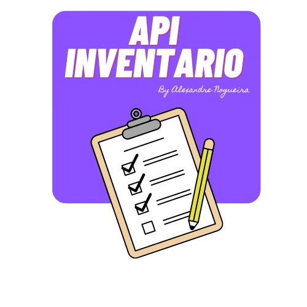

   
  <!-- project name -->
  <h1 align="center">API de Inventario</h1>

# Diretrizes de Contribuição

Obrigado por considerar contribuir para este projeto! Seguir estas diretrizes ajudará a garantir que sua contribuição seja clara, eficaz e bem-vinda.

## Como Contribuir

1. **Abra uma Issue:** Antes de começar a trabalhar em uma nova funcionalidade ou correção de bug, abra uma issue para discutir sua proposta. Isso permite uma discussão sobre a melhor abordagem e evita trabalho redundante.

2. **Fork do Repositório:** Faça um fork do repositório para sua conta GitHub e trabalhe em sua própria cópia.

3. **Crie uma Branch:** Para cada nova funcionalidade ou correção de bug, crie uma branch separada a partir do branch principal  `main` .

4. **Desenvolva e Teste:** Desenvolva sua funcionalidade ou correção de bug e certifique-se de testá-la completamente.

5. **Envie um Pull Request:** Quando estiver pronto, envie um pull request para o repositório original. Certifique-se de incluir uma descrição clara do que foi feito e quaisquer mudanças relevantes.

## Diretrizes de Código

- Siga as convenções de codificação existentes no projeto.
- Mantenha o código claro, conciso e bem documentado.
- Certifique-se de que o código novo ou alterado seja testado e não quebre os testes existentes.
- Evite fazer muitas mudanças em um único pull request. Mantenha-os pequenos e focados em uma única funcionalidade ou correção de bug.

## Diretrizes de Comunicação

- Seja respeitoso com outros contribuidores e mantenha um ambiente colaborativo.
- Esteja aberto a feedback e sugestões de outros membros da comunidade.
- Responda prontamente aos comentários e perguntas relacionadas ao seu pull request.

## Reconhecimento

Agradecemos todas as contribuições para este projeto e reconhecemos o tempo e esforço que os contribuidores dedicam. Se sua contribuição for aceita, você será listado como um colaborador no arquivo de histórico do projeto.

 
 

  

