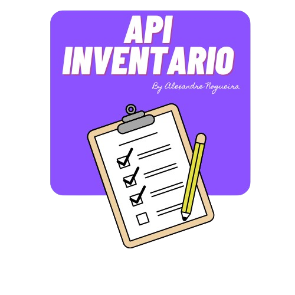

<div align="center">
   
  <!-- project name -->
  <h1 align="center">API de Inventario</h1>
  
  <!-- project badges -->
  <p align="center">   
       
    
    
    
  </p> 

  <!-- project description and menu -->
  <p align="center">
      Em Construção.
    <br />
    <a 
      href="## Usage">
      <strong>Go to usage now »</strong>
    </a>
    <br />
    <br />
    <a 
      href="https://github.com/Alxdelira/api-jfro/issues">
      Report Bug
    </a>
    ·
    <a 
      href="https://github.com/Alxdelira/api-jfro/issues/new">
      Request Feature
    </a>
  </p>
</div>

<!-- ## Preview

<div align="center">
  <a href="#">
      
  </a>
</div> -->

## 🔥 Features
- [x] Autenticação de usuários para acesso seguro à API;
- [x] Gerenciamento completo de usuários, incluindo adição, atualização, visualização e exclusão;
- [x] Capacidade de armazenar e manipular imagens de ativos associadas aos itens do inventário;
- [ ] Organização hierárquica de setores e sub-setores para uma gestão eficiente de inventários complexos;
- [x] Operações de CRUD (criar, ler, atualizar, excluir) para itens de inventário, permitindo um controle preciso sobre os ativos;
- [ ] Suporte para geração de relatórios personalizados com informações detalhadas sobre o inventário;
- [x] API RESTful com documentação clara e abrangente para facilitar a integração e o desenvolvimento de aplicativos clientes;
- [ ] Funcionalidade de rastreamento de histórico para acompanhar as alterações nos itens do inventário ao longo do tempo;
- [x] Capacidade de realizar auditorias de inventário para garantir a precisão e integridade dos dados;
- [ ] Notificações em tempo real para alertar sobre eventos importantes relacionados ao inventário, como mudanças de status ou itens próximos à data de vencimento;
- [ ] Funcionalidade de análise e previsão para identificar tendências e otimizar o gerenciamento de inventário com base em dados históricos e atuais.


## Technologies

This project was developed with the following technologies:

- `typescript`: [TypeScript on GitHub](https://github.com/microsoft/TypeScript)
- `bcrypt`: [bcrypt.js on GitHub](https://github.com/dcodeIO/bcrypt.js)
- `cors`: [npm cors](https://www.npmjs.com/package/cors)
- `dotenv`: [dotenv on GitHub](https://github.com/motdotla/dotenv)
- `express`: [Express.js on GitHub](https://github.com/expressjs/express)
- `jsonwebtoken`: [jsonwebtoken on GitHub](https://github.com/auth0/node-jsonwebtoken)
- `mongoose`: [Mongoose on GitHub](https://github.com/Automattic/mongoose)
- `mongoose-paginate-v2`: [npm mongoose-paginate-v2](https://www.npmjs.com/package/mongoose-paginate-v2)
- `tsup`: [tsup on NPM](https://www.npmjs.com/package/tsup)
- `Swagger`: [swagger-UI on  GitHub](https://github.com/swagger-api/swagger-ui)
- `Multer`: [Express.Js - multer](https://github.com/expressjs/multer)
- `Mongo DB Atlas`: [MongoDB - Atlas](https://www.mongodb.com/pt-br)
- `NodeMailer`: [NodeMailer](https://www.nodemailer.com/)


## Building

You'll need [Node.js](https://nodejs.org) installed on your computer in order to build this app.

```bash
git clone https://github.com/Alxdelira/api-jfro.git
$ cd api-jfro
$ npm install
$ npm run dist
```


## Usage

🔧 Run the script

```bash
$ npm run dev
```


Runs the app in the development mode.<br/>

## Autor

| [<br><sub>Alexandre Nogueira</sub>](https://github.com/Alxdelira) |
| :---------------------------------------------------------------------------------------------------------------------------------------: |
<a target="_blank" href="https://www.linkedin.com/in/alxdelira/"></a>

<br />
<br />
<br />
<br />
<br />
<br />
<p align="center">
  <a href="https://portfolioalxdelira.vercel.app/" target="_blank">
    
  </a>
</p>